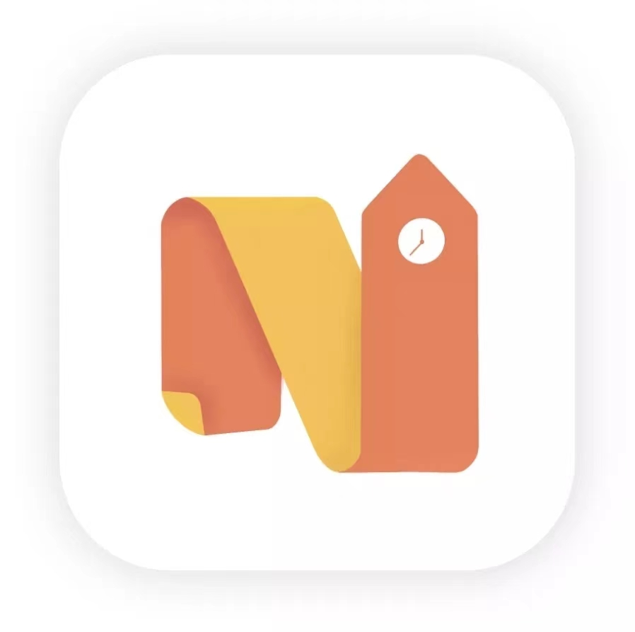

<div align="center">
<!-- Title: -->
  
  <h1>Nottinghome - 诺圈</h1>

  <h3>The exclusive social platform for UNNC students. </h3>
  <h5> Contributor: Jumbox team </h5>
</div>


## Nottinghome项目环境配置（以Mac电脑为例）

### VSCode

###### [点击前往下载](https://code.visualstudio.com/)

vscode用于git操作

配置：

打开vscode-拓展-搜索“Conventional Commits”-下载(用于在vscode上进行约定式提交)


### IntelliJ IDEA

###### [点击前往下载](https://www.jetbrains.com/idea/download/#section=mac)

IntelliJ IDEA用于后端代码编辑及操作

配置：

打开 com/nuoquan/Application.java， 直接运行main函数完成配置


### <span id="sql">MySQL</span>

###### [点击前往下载](https://dev.mysql.com/downloads/mysql/)

配置：

正常下载安装就好

安装时选择强安全性（需设置密码）


### MySQL Workbench

###### [点击前往下载](https://dev.mysql.com/downloads/workbench/)

MySQL Workbench用于数据库操作

配置：

新建连接，自定义Connection Name, 将Hostname改为localhost

端口号默认3306

使用该连接，新建schemas，命名为pivot并设置为默认，导入并运行pivot.sql文件


### Hbuilder

##### [点击前往下载](https://www.dcloud.io/hbuilderx.html)

配置：打开Hbuilder， 点击 运行-运行到小程序模拟器-微信开发者工具


### 微信开发者工具

##### [点击前往下载](https://developers.weixin.qq.com/miniprogram/dev/devtools/download.html)
配置：打开微信开发者工具， 设置-安全设置-打开服务端口
（此操作目的为允许Hbuilder打开微信开发者工具）


### Redis

###### [点击前往下载](https://redis.io/download/)

配置：

将下载后的文件夹（若用homebrew下载则不管）放入/usr/local/bin/路径

打开命令行，输入

```
shaoyifei@ShaodeMacBook-Air ~ % redis-server
```

新建命令行，输入

```
shaoyifei@ShaodeMacBook-Air ~ % redis-cli
127.0.0.1:6397>config set requirepass yourname
OK
127.0.0.1:6379>auth yourname
OK
127.0.0.1:6379>
```

此时redis已正常运行

完成以上配置后，修改后端代码

nuoquan-dev/nuoquan-dev-api/src/main/resources/application-dev.properties文件

```
com.jumbox.ssl.path=C:\\Users\\zyl\\Desktop\\Nuoquan\\Nuoquan\\nuoquan-dev\\ssl_cert\\www.checkchack.cn.jks	
																					// ssl配置，暂时不用改
spring.datasource.nq1.jdbc-url=jdbc:mysql://localhost:3306/pivot?useUnicode=true&serverTimezone=UTC					// 数据库端口及数据库schema名称
spring.datasource.nq1.username=root				// 数据库用户名称，未修改
spring.datasource.nq1.password=123456			// 数据库密码
spring.datasource.nq1.driver-class-name=com.mysql.cj.jdbc.Driver
```

完成以后操作后，稳定版本的后端代码应可以正常运行并通过swagger测试

后端代码正常运行需mysql和redis运行提供支持


## 支点项目结构及注意事项

### Git Structure

#### Git Branch

master - 主分支，仅merge稳定版本代码（无bug，可以面向用户）

develop - 主开发分支，跟进开发进度（持续集成，个人将完成开发的新功能merge到develop分支进行测试以及bug修复）

feature - 功能开发分支，由开发个人创建

- 分支命名规范: feature-前/后端-具体功能名-开发者   e.g., 简历部分开发（后端）: feature-B-resume-YBY   （前端）: feature-F-resume-HZL
- 每一次功能开发完成（并测试）后都需要merge到Develop分支， 新的开发工作新建分支来完成。

#### 提交注释

注释提交规范:

- type : (scope) : subject : (body)

##### type(必须)

feat：新功能（feature）
fix：修补
docs：文档（documentation）
style： 格式（不影响代码运行的变动）
refactor：重构（即不是新增功能，也不是修改bug的代码变动）
test：增加测试
chore：其他的小改动. 一般为仅仅一两行的改动, 或者连续几次提交的小改动属于这种
revert：feat(pencil): add ‘graphiteWidth’ option (撤销之前的commit)
upgrade：升级改造
bugfix：修补bug
optimize：优化
perf: Performance的缩写, 提升代码性能
test：新增测试用例或是更新现有测试
ci:主要目的是修改项目继续完成集成流程(例如Travis，Jenkins，GitLab CI,Circle)的提交
build: 主要目的是修改项目构建系统(例如glup，webpack，rollup的配置等)的提交		  

##### scope (注释一般不写作用域)

scope用于说明 commit 影响的范围，比如数据层、控制层、视图层等等，视项目不同而不同。

##### subject（必需）

commit 目的的简短描述，不超过50个字符。概括此次修改内容

##### body

对本次 commit 的详细描述，可以分成多行

##### example

docs:readme文档内添加注释规范

feat:完成向HR发送邮件功能业务模型:包含整合投递信息以及简历PDF，核实HR账号和邮箱以及邮件发送。


#### 使用vscode进行约定式提交

Step 1: 打开git项目文件，点击左侧导航栏“源代码管理”。

Step 2: 点击“+”添加更改（相当于git add.操作），点击后此项会进入“已暂存更改”。
		点击“-”可以取消添加。
		点击撤“放弃所有更改”按钮会撤销所有已修改数据（撤销本次所有修改，且无法找回）。


Step 3: 点击“○”进行约定式提交， 根据提示进行填写（作用域通常选“无作用域”）， 按“esc”退出提交。


### Project Structure

#### nuoquan-client

前端代码

#### nuoquan-dev

后端代码

nuoquan-dev-api

- controller层， 负责请求转发，接受页面过来的参数，传给Service处理，接到返回值，再传给页面。管理业务（Service）调度和管理跳转。

nuoquan-dev-common

nuoquan-dev-mapper (dao层) 方法名与mapper中id名相同

- mapper层，数据持久层，先设计接口，然后在配置文件中进行配置其实现的关联。

- 访问数据库，向数据库发送sql语句，完成crud（增加Create、检索Retrieve、更新Update和删除Delete）。

nuoquan-dev-pojo (model)

- 存放实体类， 类中定义了多个类属性，并与数据库表的字段保持一致，一张表对应一个model类。

- 主要用于定义与数据库相应的属性， 提供get/set方法等。

- vo层: 方便前端获取数据，后端将前端的需要的数据做一个整合，打包成一个类。

nuoquan-dev-service 函数实现

- 业务逻辑层，完成功能设计，和dao层一样都是先设计接口在创建要实现的类，然后在配置文件中进行配置。并在service层调用dao层的接口进行业务逻辑应用的处理。

- service包含了serviceImpl（service接口的实现类） 是提供给controller 使用的，针对于某些业务将dao的对于某些表的crud（增加Create、检索Retrieve、更新Update和删除Delete）进行组合，也就是说间接的和数据库打交道。	


#### .sql

数据库

用MySQLWorkBench运行与编辑。可以使用自动生成的ERD协助理解。

[数据库使用与配置见1.3](#mysql)


## Nottinghome项目上线部署

### 微信小程序配置

登陆微信公众平台，获取小程序开发设置中的AppId, AppSecret(若不记得了让管理员扫码验证重置)

将AppId, AppSecret配置至后端properties及前端manifest.json对应位置

在后端，需每年更新ssl证书至ssl-cert文件夹，并修改application.properties文件对应内容

### 后端打包

点击右侧导航栏“maven”。

点击“支点Pivot(root)”-“Lifecycle”。

依次双击“clean”， “compile”， “package”（每次双击后等待运行完成再双击下一项）。

在 nuoquan-dev/nuoquan-dev-api/target找到打包的nuoquan-dev-api-0.0.1-SNAPSHOT.jar


### 后端部署

[点击跳转教程](https://blog.csdn.net/weixin_43389219/article/details/125275146)

后端部署以Windows电脑为例（Mac下载不了相关软件）

将后端打包好的.jar包改名为pivot.jar，替换服务器根目录下的同名文件

在XShell中输入

```lsof -i:8080```

检测8080端口是否有被占用（一般都被之前的进程占用掉了）

输入

```kill -9 端口号```

杀死原进程

输入

```nohup java -jar pivot.jar &```

运行后端，后端会持续运行即使断开与服务器的连接，运行结果会记录在nohup.out文件中

### 前端打包部署

[点击跳转教程](https://blog.csdn.net/qq_52736131/article/details/122400103?ops_request_misc=&request_id=&biz_id=102&utm_term=uniapp%20vue%E6%89%93%E5%8C%85%E5%B0%8F%E7%A8%8B%E5%BA%8F&utm_medium=distribute.pc_search_result.none-task-blog-2~all~sobaiduweb~default-0-122400103.142^v17^pc_search_result_control_group,157^v14^new_3&spm=1018.2226.3001.4187)


### 小程序上线


